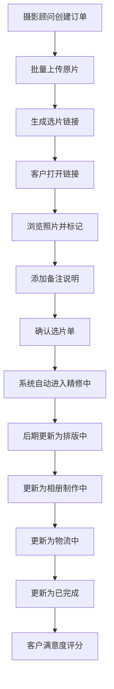
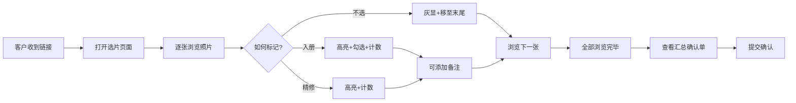

## 1. 产品概述
婚纱摄影工作室客户选片与制作进度跟踪系统，解决客户选片效率低、制作进度不透明、数据统计困难的问题。
- 主要目的：提升客户选片体验，标准化制作流程，实现数据化运营
- 目标用户：小型婚纱摄影工作室（客服、摄影顾问、后期制作人员、客户）
- 产品价值：缩短选片周期30%，提升客户满意度，降低沟通成本

## 2. 核心功能

### 2.1 用户角色
| 角色 | 登录方式 | 核心权限 |
|------|---------|---------|
| 系统管理员 | 账号密码 | 用户管理、系统配置、全权限操作 |
| 摄影顾问 | 账号密码 | 客户管理、订单创建、查看制作进度、个人数据统计 |
| 客服人员 | 账号密码 | 制作进度查询、客户沟通记录、全局进度视图 |
| 后期人员 | 账号密码 | 制作状态更新、精修管理、排版管理 |
| 客户 | 选片链接（无需登录） | 在线选片、添加备注、查看制作进度、满意度评分 |

### 2.2 功能模块
1. **工作台（首页）**：待办事项、今日统计、进度看板
2. **客户与订单管理**：客户列表、订单创建、订单详情
3. **照片上传与选片管理**：批量上传、选片链接生成、选片进度追踪
4. **客户选片界面**：照片浏览、标记（入册/精修/不选）、备注添加、选片确认
5. **制作进度跟踪**：状态流转、时间节点记录、进度查询
6. **数据统计中心**：月度成片数、精修张数、满意度评分、顾问排名
7. **系统设置**：用户管理、角色权限、系统配置

### 2.3 页面详情
| 页面名称 | 模块名称 | 功能描述 |
|---------|---------|---------|
| 工作台 | 待办卡片 | 展示待上传照片、待选片、待精修等任务数量及快捷入口 |
| 工作台 | 统计概览 | 本月订单数、进行中订单、已完成订单、客户满意度均值 |
| 工作台 | 进度时间轴 | 近期状态变更记录时间轴展示 |
| 客户列表 | 搜索筛选 | 按姓名/手机号/顾问/状态搜索 |
| 客户列表 | 客户卡片 | 展示客户基本信息、订单状态、最近更新时间 |
| 订单详情 | 客户信息 | 客户姓名、联系方式、摄影顾问、拍摄日期、套餐信息 |
| 订单详情 | 照片管理 | 批量上传区域、照片列表、选片状态统计 |
| 订单详情 | 选片链接 | 生成/复制选片链接、设置有效期 |
| 订单详情 | 制作进度 | 状态时间轴、每个状态的更新时间、操作人 |
| 客户选片页 | 顶部导航 | 客户姓名、选片进度（已选/总数）、提交确认按钮 |
| 客户选片页 | 照片网格 | 瀑布流布局，支持按标记类型筛选 |
| 客户选片页 | 照片详情弹层 | 大图预览、三个标记按钮、备注输入框 |
| 客户选片页 | 已选汇总 | 入册数量、精修数量、备注列表 |
| 选片确认单 | 选片结果 | 入册照片列表、精修照片列表、所有备注汇总 |
| 选片确认单 | 确认签署 | 客户签名/确认、提交后自动同步制作进度 |
| 制作进度中心 | 全局筛选 | 按状态/顾问/日期筛选 |
| 制作进度中心 | 状态看板 | 五列看板（精修中/排版中/相册制作中/物流中/已完成） |
| 制作进度中心 | 状态更新 | 点击卡片可更新状态、记录操作备注 |
| 数据统计 | 月度概览 | 折线图展示每月成片数和精修数趋势 |
| 数据统计 | 顾问排行 | 表格展示各顾问成片数、精修张数、满意度均值及排名 |
| 数据统计 | 满意度分析 | 评分分布饼图、平均分展示 |
| 系统设置 | 用户管理 | 添加/编辑/禁用用户账号、分配角色和摄影顾问绑定 |

## 3. 核心流程

### 3.1 主业务流程
摄影顾问创建客户订单 → 上传所有原片 → 生成选片链接发送给客户 → 客户在线选片并添加备注 → 客户确认选片单 → 系统自动更新状态为"精修中" → 后期人员依次更新状态（排版中→相册制作中→物流中→已完成） → 客户可随时查询进度并评分

### 3.2 选片流程

## 4. 用户界面设计

### 4.1 设计风格
- **主色调**：玫瑰金 #D4A574（高端婚纱摄影质感）
- **辅助色**：暖粉色 #F8E8E0、深灰色 #2D2D2D、白色底
- **强调色**：香槟金 #E8C99B、墨绿色 #4A7C59（完成状态）、珊瑚红 #E07A5F（警示）
- **按钮风格**：圆角 12px，主按钮玫瑰金渐变，次要按钮描边
- **字体**：标题使用 Noto Serif SC（衬线，优雅），正文使用 PingFang SC / Microsoft YaHei（无衬线，清晰易读）
- **布局风格**：卡片式布局 + 左侧导航栏，卡片圆角 16px，精致阴影
- **图标风格**：线性图标（Lucide Icons），统一 24px，与主色调呼应

### 4.2 页面设计概览
| 页面名称 | 模块名称 | UI 元素 |
|---------|---------|---------|
| 工作台 | 统计卡片 | 渐变背景卡片、数字动效、趋势箭头、大图标装饰 |
| 工作台 | 时间轴 | 竖线时间轴、圆点状态标记、悬停高亮 |
| 客户选片页 | 照片网格 | 瀑布流 3-4 列、角标状态标记、悬停放大效果 |
| 客户选片页 | 标记按钮 | 三个大号按钮（绿色入册/金色精修/灰色不选）、点击反馈动画 |
| 选片确认单 | 汇总列表 | 分组展示、缩略图预览、备注气泡、打印样式优化 |
| 制作进度中心 | 状态看板 | 五列并排、卡片拖拽式视觉、颜色区分各阶段 |
| 数据统计 | 图表区域 | 渐变折线图、环形满意度图、表格斑马纹 |

### 4.3 响应式
- **优先**：桌面端设计（1440px 及以上）
- **适配**：平板（1024px）：侧边栏折叠为图标，照片网格降为 2 列
- **适配**：客户选片页移动端（375px）：单列照片、底部悬浮操作栏
- 触摸设备：按钮最小 44x44px，手势滑动支持

### 4.4 动效与细节
- 页面加载：卡片从下至上错峰淡入（stagger 100ms）
- 照片标记：点击时卡片缩放 + 角标弹跳动画
- 状态更新：进度条平滑过渡，时间节点微光效
- 数据统计：数字滚动计数动画
