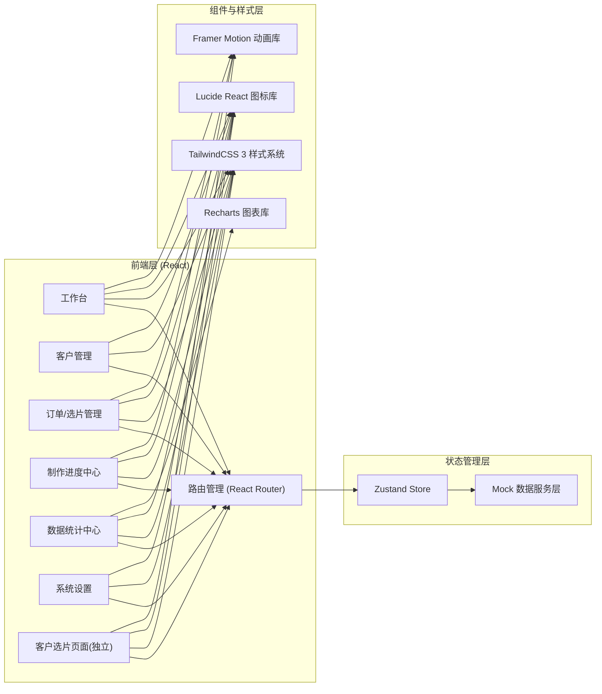
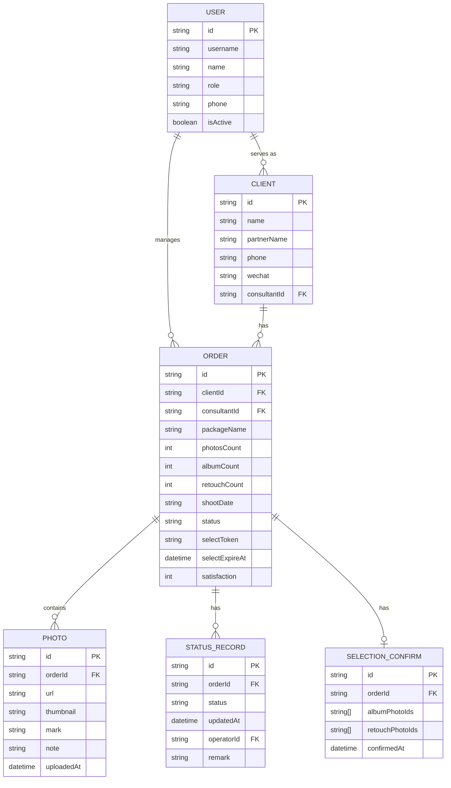

## 1. 架构设计



## 2. 技术说明

- **前端框架**：React@18 + TypeScript@5（类型安全，提升可维护性）
- **初始化工具**：Vite@5（极速冷启动、HMR）
- **样式方案**：TailwindCSS@3（原子化CSS，统一设计令牌）
- **路由管理**：React Router@6
- **状态管理**：Zustand（轻量级，比 Redux 更简洁）
- **图标库**：Lucide React（线性风格，优雅一致）
- **图表库**：Recharts（React 原生，与 React 完美集成）
- **动画库**：Framer Motion（声明式动画，流畅体验）
- **后端**：无独立后端，使用前端 Mock 数据层 + LocalStorage 持久化
- **数据持久化**：LocalStorage（订单/选片结果/进度状态）

## 3. 路由定义

| 路由 | 用途 |
|------|------|
| `/login` | 系统登录页 |
| `/dashboard` | 工作台 - 统计概览、待办、最近动态 |
| `/clients` | 客户列表 - 搜索筛选、客户卡片列表 |
| `/clients/:id` | 客户/订单详情 - 客户信息、照片上传、选片链接、制作进度 |
| `/progress` | 制作进度中心 - 五列看板、状态流转 |
| `/statistics` | 数据统计中心 - 月度趋势、顾问排行、满意度 |
| `/settings` | 系统设置 - 用户管理、权限配置 |
| `/select/:token` | 客户选片页面（公开链接，无需登录） |
| `/select/:token/confirm` | 选片确认单页面 |

## 4. 数据模型（Mock 数据结构）

### 4.1 类型定义

```typescript
// 用户角色
type UserRole = 'admin' | 'consultant' | 'service' | 'editor';

// 订单制作状态
type ProductionStatus = 
  | 'pending_photos'    // 待上传照片
  | 'pending_selection' // 待客户选片
  | 'retouching'        // 精修中
  | 'layout'            // 排版中
  | 'album_making'      // 相册制作中
  | 'shipping'          // 物流中
  | 'completed';        // 已完成

// 照片选片标记
type PhotoMark = 'none' | 'album' | 'retouch' | 'reject';

// 用户
interface User {
  id: string;
  username: string;
  name: string;
  role: UserRole;
  phone?: string;
  avatar?: string;
  isActive: boolean;
  createdAt: string;
}

// 客户
interface Client {
  id: string;
  name: string;          // 客户姓名（新郎）
  partnerName: string;   // 伴侣姓名（新娘）
  phone: string;
  wechat?: string;
  address?: string;
  consultantId: string;  // 摄影顾问ID
  createdAt: string;
}

// 订单
interface Order {
  id: string;
  clientId: string;
  consultantId: string;
  packageName: string;       // 套餐名称
  photosCount: number;       // 原片总数
  albumCount: number;        // 入册张数（套餐规定）
  retouchCount: number;      // 精修张数（套餐规定）
  shootDate: string;         // 拍摄日期
  status: ProductionStatus;
  selectToken: string;       // 选片链接token
  selectExpireAt: string;    // 选片链接有效期
  satisfaction?: number;     // 客户满意度 1-5
  statusHistory: StatusRecord[];
  createdAt: string;
}

// 状态变更记录
interface StatusRecord {
  status: ProductionStatus;
  updatedAt: string;
  operatorId: string;
  remark?: string;
}

// 照片
interface Photo {
  id: string;
  orderId: string;
  url: string;
  thumbnail: string;
  filename: string;
  mark: PhotoMark;
  note?: string;        // 客户备注
  uploadedAt: string;
}

// 选片确认单
interface SelectionConfirm {
  orderId: string;
  albumPhotoIds: string[];
  retouchPhotoIds: string[];
  notes: { photoId: string; content: string }[];
  confirmedAt: string;
  clientSignature?: string;
}
```

### 4.2 ER 关系图



## 5. 目录结构

```
src/
├── assets/              # 静态资源
│   └── images/          # 示例照片（占位）
├── components/          # 通用组件
│   ├── ui/              # 基础UI组件（Card, Button, Modal, Badge等）
│   ├── layout/          # 布局组件（Sidebar, TopNav, PageContainer）
│   ├── PhotoGrid/       # 照片网格组件
│   ├── StatusTimeline/  # 进度时间轴
│   ├── StatusBadge/     # 状态标签
│   └── StatCard/        # 统计卡片
├── pages/               # 页面组件
│   ├── Login/
│   ├── Dashboard/
│   ├── Clients/
│   ├── ClientDetail/
│   ├── Progress/
│   ├── Statistics/
│   ├── Settings/
│   └── SelectPhoto/     # 客户选片页（含确认单）
├── store/               # Zustand Store
│   ├── useAuthStore.ts
│   ├── useClientStore.ts
│   ├── useOrderStore.ts
│   ├── usePhotoStore.ts
│   └── useProgressStore.ts
├── mock/                # Mock数据
│   ├── data/            # 静态mock数据
│   └── seed.ts          # 种子数据生成脚本
├── types/               # TypeScript类型定义
│   └── index.ts
├── utils/               # 工具函数
│   ├── date.ts
│   ├── storage.ts
│   └── token.ts
├── hooks/               # 自定义Hooks
├── App.tsx
├── main.tsx
└── index.css
```

## 6. 开发阶段建议

1. **Phase 1 - 项目初始化**：Vite + React + TS + TailwindCSS 搭建，配置目录结构
2. **Phase 2 - 基础框架**：路由系统、布局组件（侧边栏/顶部导航）、登录页、Mock数据层
3. **Phase 3 - 核心模块**：客户管理、订单详情、照片上传（模拟）、选片链接生成
4. **Phase 4 - 客户选片**：选片页面、照片标记、备注、选片确认单
5. **Phase 5 - 制作进度**：状态看板、状态流转、时间节点记录
6. **Phase 6 - 数据统计**：月度趋势图、顾问排行表、满意度分析
7. **Phase 7 - 优化打磨**：动效、响应式、交互细节、数据持久化
